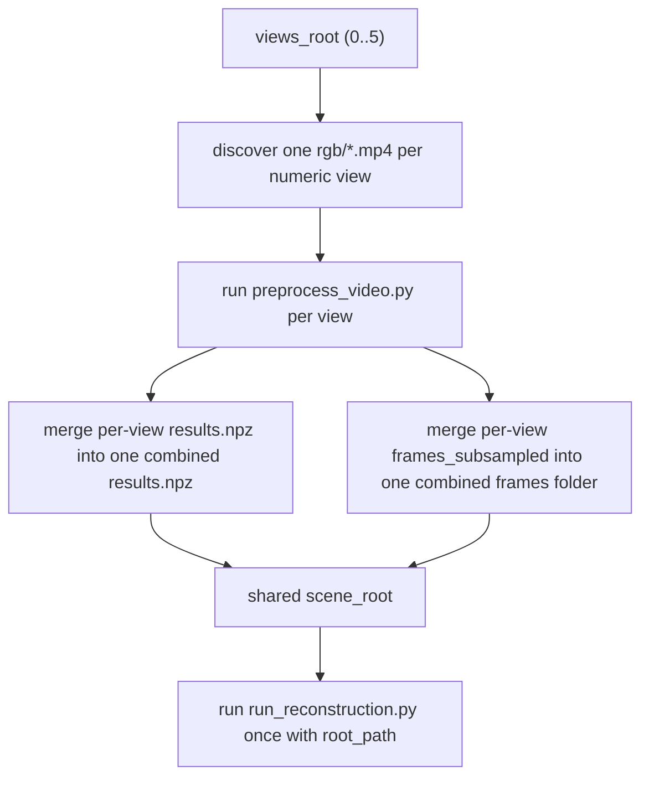
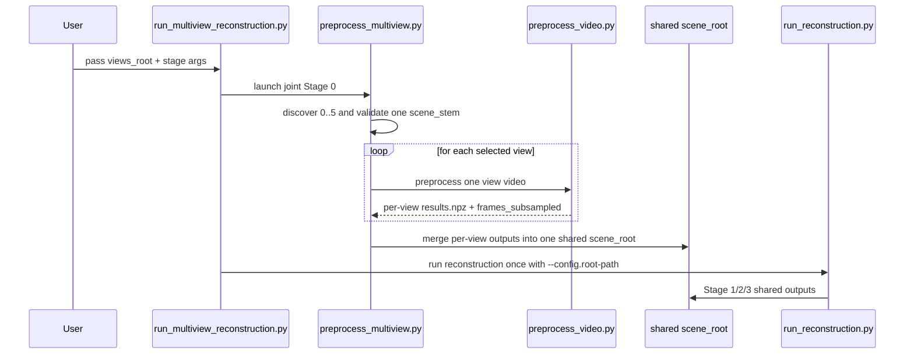

# Multi-View Joint Reconstruction Flow

## Goal

Provide one joint entry point for folders like:

```text
source/flashvsr_reference_xhc_bai/full_scale2x/
  0/rgb/xhc-bai_97e474c6.mp4
  1/rgb/xhc-bai_97e474c6.mp4
  ...
  5/rgb/xhc-bai_97e474c6.mp4
```

All selected views should be merged into one shared `scene_root`, then Stage 1/2/3 should run only once on that merged scene.

## Flowchart



## Sequence


